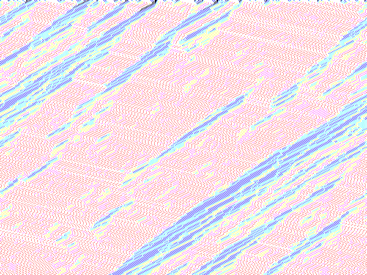

OCaml - Traffic Jams Cellular Automaton
=======================================

This code was originally written in Caml Light (in 2006), the main changes to port it to OCaml were:

 - `make_vect` becomes `Array.make`
 - `vect_length` becomes `Array.length`
 - the module imports had to be updated

To get the `Graphics`module:

    brew [re]install ocaml --with-x11

To get the OCaml package manager:

    brew install opam

To get terminal history:

    brew install rlwrap
	alias ocaml="rlwrap ocaml"

To install the dependencies of this code:

    opam install Camlimages

Finally, to run the code:

    cat trafficjams.ml | ocaml

Et voilà!

